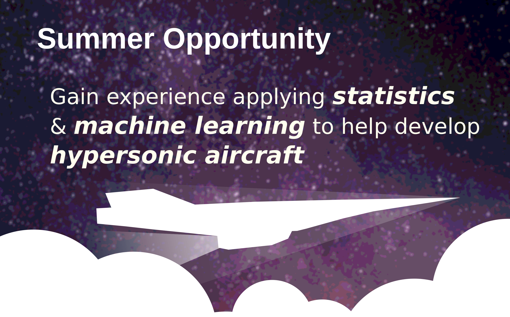

# Summer Research Opportunity [[flyer](hyperstats.pdf)]

## Gain experience applying statistics and machine learning to help develop hypersonic aircraft

Participate in an 8-week summer research internship at William & Mary, where you will enhance your programming, statistics, and machine learning skills by tackling real-world challenges in the field of hypersonic aerodynamics.

Collaborate with a small cohort of fellow participants and a larger group of summer research students at William & Mary.

**Who:** Openings available for high school juniors/seniors and undergraduate students. While some background in mathematics and programming is preferred, no prior aerospace experience is necessary. Individuals pursuing or interested in fields such as statistics, applied mathematics, mathematics, aerospace engineering, mechanical engineering, computer science, data science, or other STEM disciplines are strongly encouraged to apply. We welcome a broad spectrum of applications across a diverse set of student experiences.

**When:** June 17th - August 9th, 2024

**Where:** William & Mary, Williamsburg, VA 23185

**Stipend:** Competitive stipend paid to help to defray living expenses.

**Housing:** Free on-campus housing for undergrads.

**How to apply:**
  
Complete the following form: [link](https://forms.gle/ENz4uTT5NjPpW3sq7)

*Application review will begin on January 12th, 2024. Applications will be reviewed until positions are filled.
*

**Contact:** Dr. Hunt, ghunt@wm.edu

Examples of projects from last year:
 
1. [example 1](exs/ex1.png)
2. [example 2](exs/ex2.png)
3. [example 3](exs/ex3.png)
