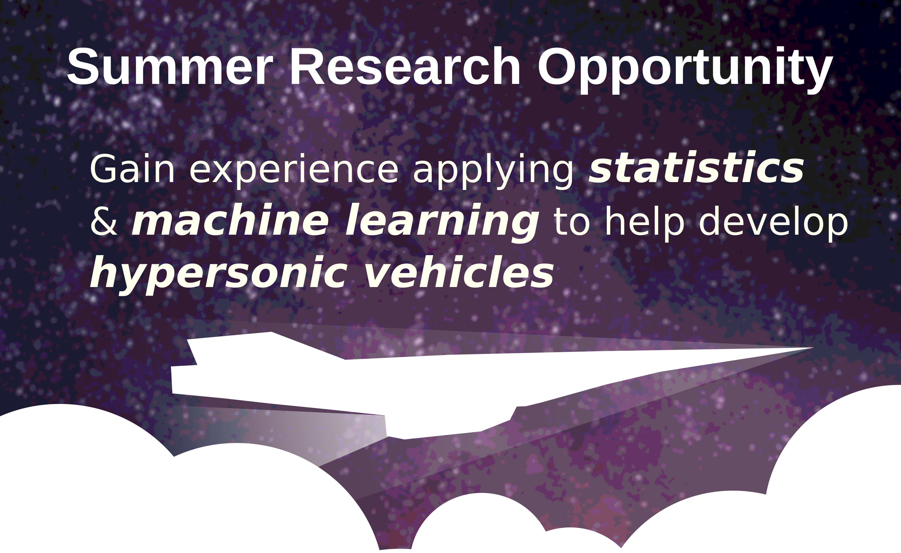

# Summer Opportunity [[flyer](hyperstats.pdf)]

## Gain experience applying statistics and machine learning to help develop hypersonic aircraft

Apply for an 8 week educational experience at William & Mary learning programming, statistics, and machine learning skills by working on problems in hypersonics. 

**Who:** Positions available for undergraduate and high school
students. No previous aerospace experience required.

**When:** June 17th - August 9th, 2024

**Where:** William & Mary, Williamsburg, VA 23185

- Stipend to help offset costs available.
- On-campus housing for undergrads.

**How to apply:**
  
Complete the following form: [link](https://forms.gle/ENz4uTT5NjPpW3sq7)

*Application close date: Jan 12, 2024*

**Contact:** Dr. Hunt, ghunt@wm.edu

Examples of projects from last year:
 
1. [example 1](exs/ex1.png)
2. [example 2](exs/ex2.png)
3. [example 3](exs/ex3.png)
